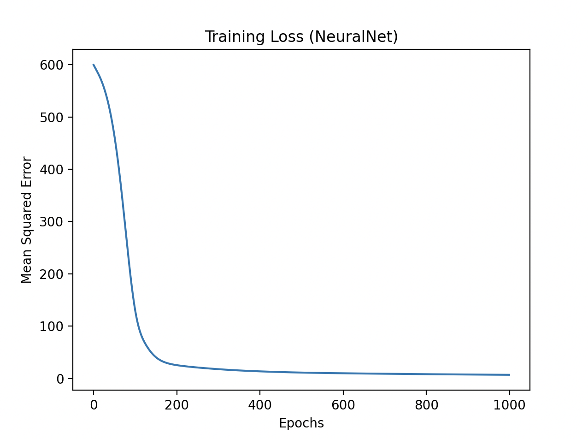
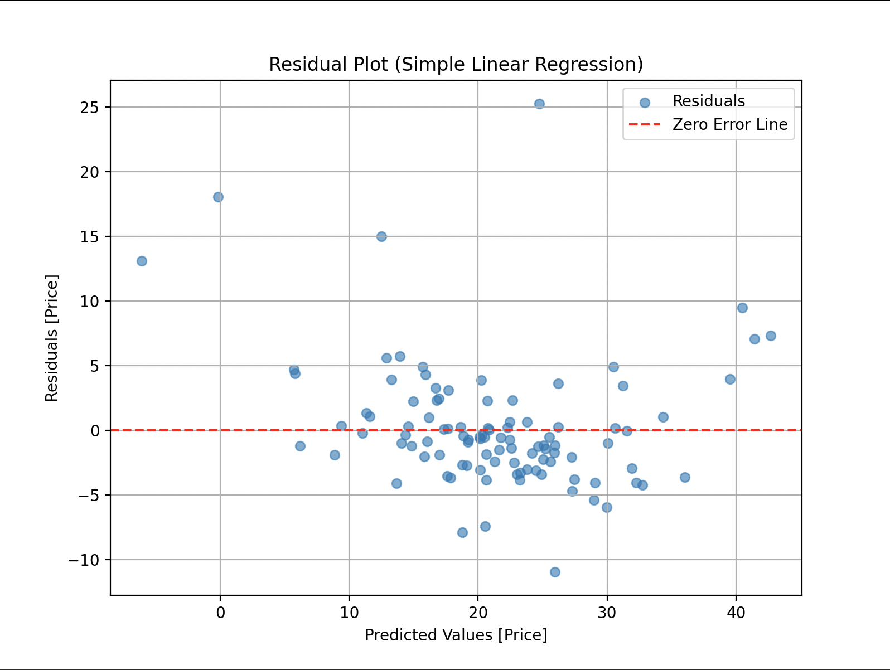
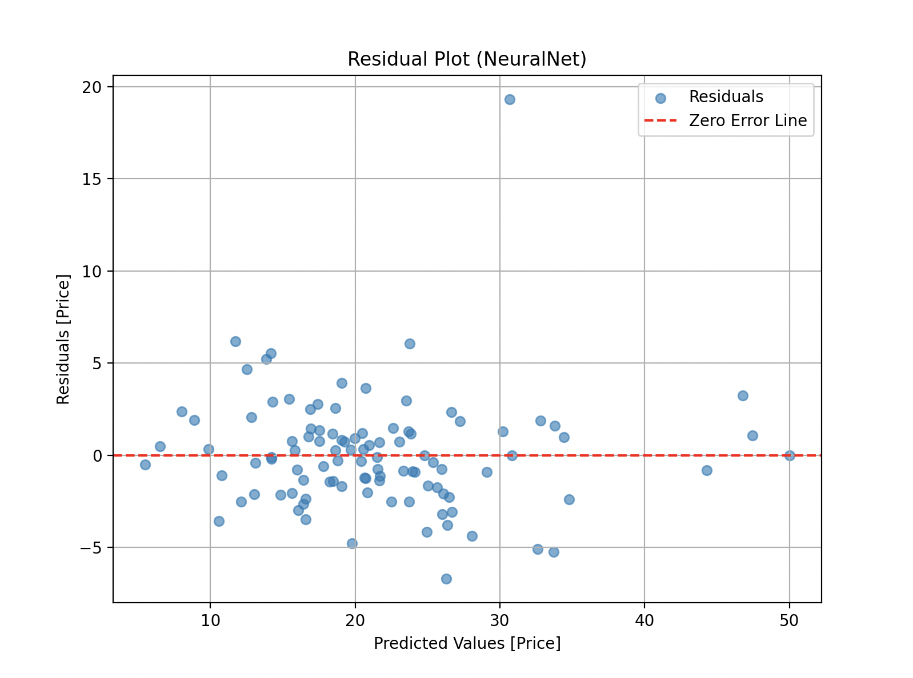
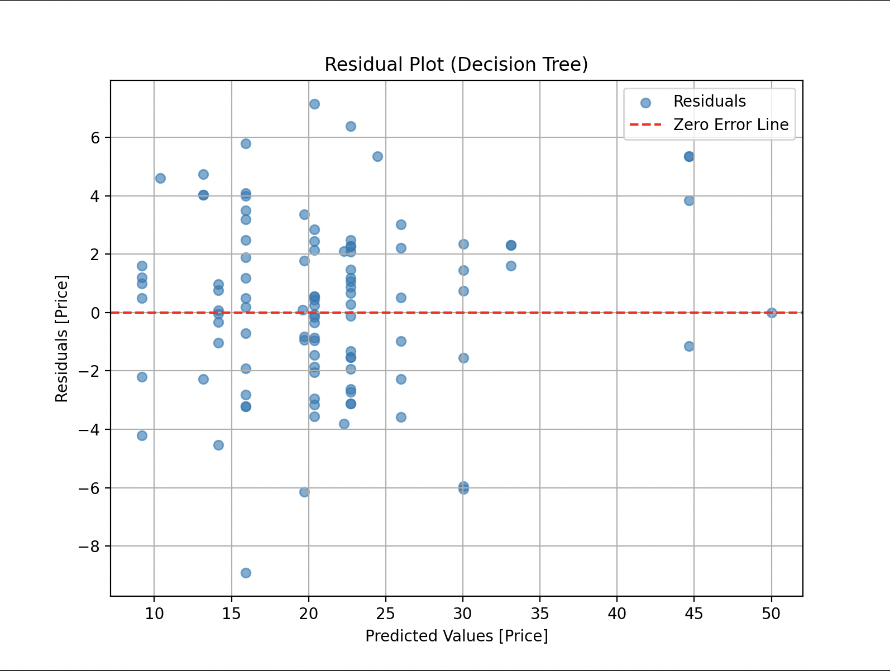
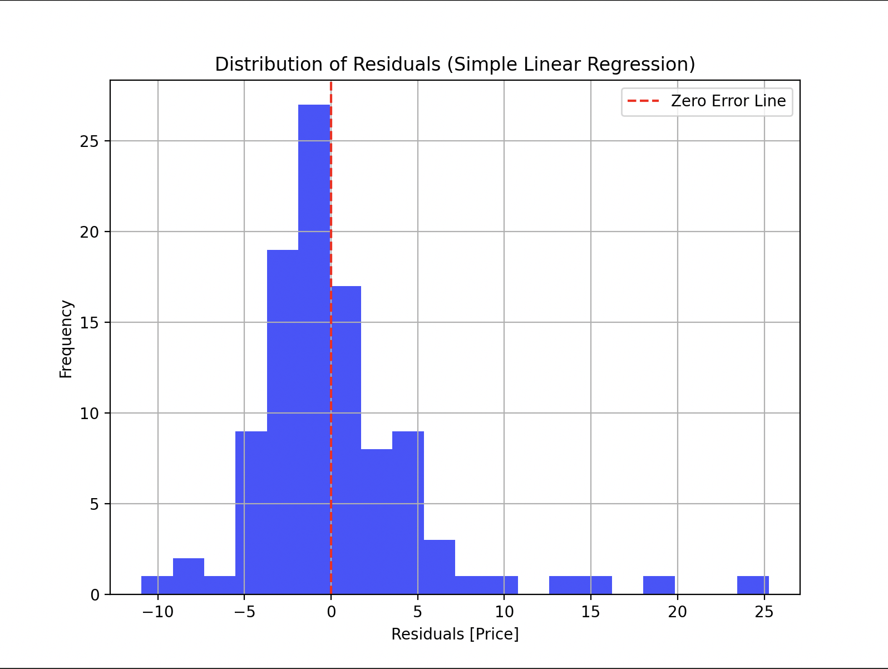
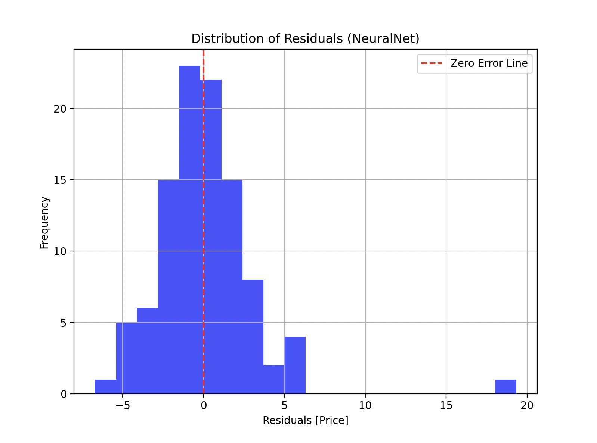
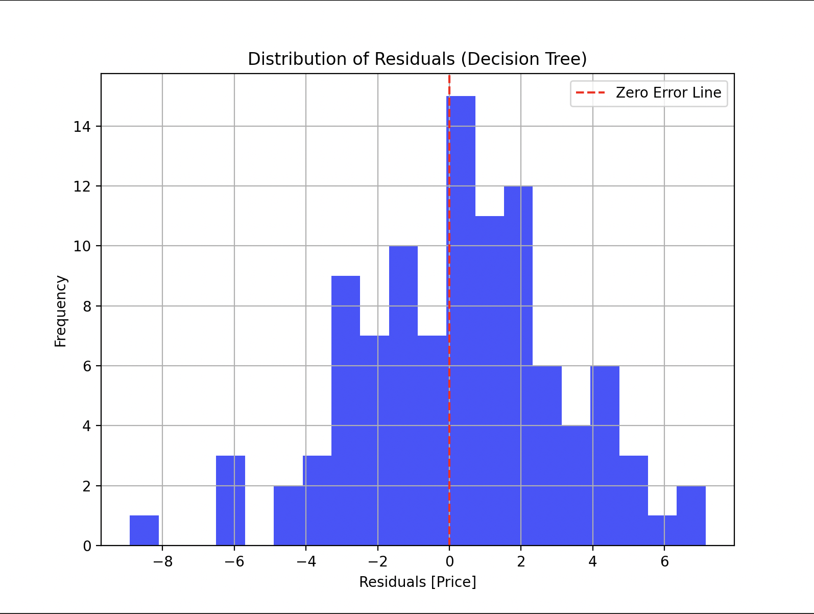
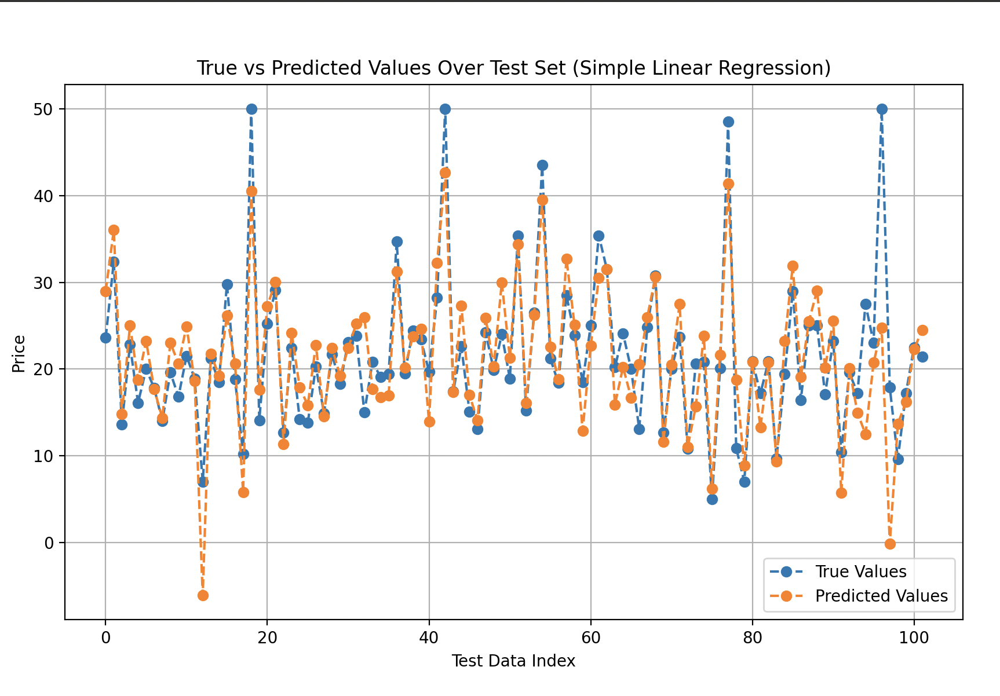
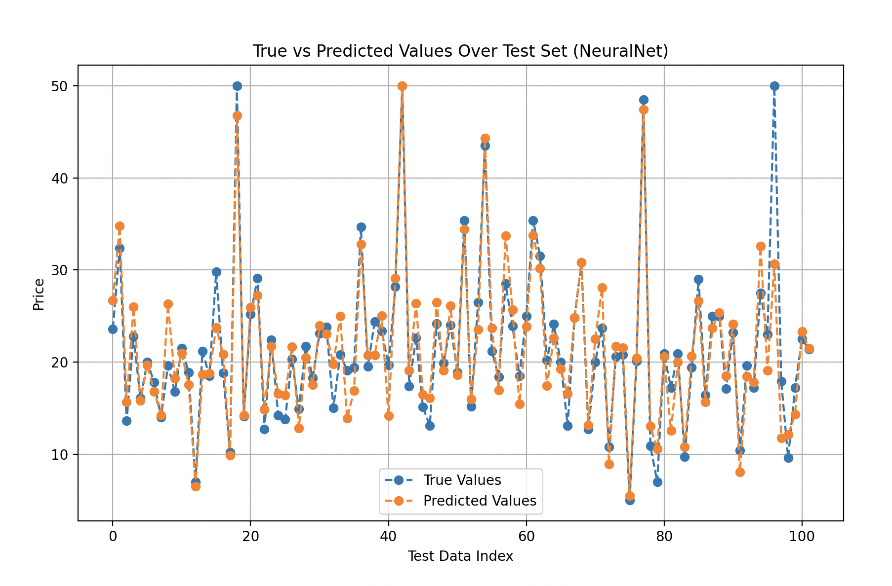
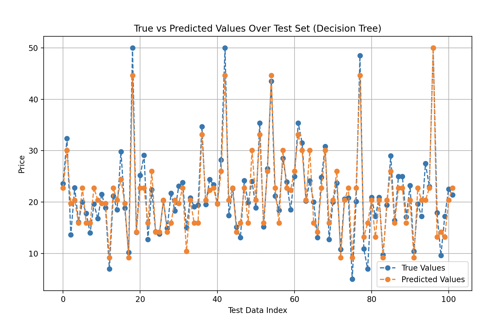

# 🏡 Boston Housing Price Prediction

This project demonstrates the use of various machine learning models to predict housing prices in Boston using the **Boston Housing Dataset**. The models implemented include:

1. **Simple Linear Regression (SLR)**.
2. **Multi-Layer Perceptron (MLP)** Neural Network with two hidden layers.
3. **Decision Tree Regressor**.

Each model's performance is evaluated using Mean Squared Error (MSE), and their predictions are compared visually to understand their strengths and weaknesses.

---

## 📂 Dataset

The **Boston Housing Dataset** contains 13 features describing housing and neighborhood conditions in Boston:
- CRIM - per capita crime rate by town
- ZN - proportion of residential land zoned for lots over 25,000 sq.ft.
- INDUS - proportion of non-retail business acres per town.
- CHAS - Charles River dummy variable (1 if tract bounds river; 0 otherwise)
- NOX - nitric oxides concentration (parts per 10 million)
- RM - average number of rooms per dwelling
- AGE - proportion of owner-occupied units built prior to 1940
- DIS - weighted distances to five Boston employment centres
- RAD - index of accessibility to radial highways
- TAX - full-value property-tax rate per $10,000
- PTRATIO - pupil-teacher ratio by town
- B - 1000(Bk - 0.63)^2 where Bk is the proportion of blacks by town
- LSTAT - % lower status of the population

The target variable, **MEDV**, represents the median value of owner-occupied homes in $1,000s.

---

## ⚙️ Methodology

1. **Data Preprocessing**:
   - Split into **80% training** and **20% testing** datasets.
   - Feature scaling using **StandardScaler** for improved model performance.

2. **Models Implemented**:
   - **Simple Linear Regression**: A basic model to establish a baseline.
   - **Multi-Layer Perceptron (MLP)**: A neural network with two hidden layers (64 and 32 neurons, respectively) using ReLU activation.
   - **Decision Tree Regressor**: A tree-based model with a max depth of 5 to avoid overfitting.

3. **Evaluation Metric**:
   - Mean Squared Error (MSE) on the test set.

---

## 📊 Results

| Model                 | Test Mean Squared Error |
|-----------------------|-------------------------|
| Simple Linear Regression | 24.2911               |
| Multi-Layer Perceptron  | 10.7376               |
| Decision Tree Regressor  | 8.5539                |

---

## 📈 Visualizations

### 1. Training Loss for MLP Model
The training loss decreases over epochs, indicating the model's convergence.


---

### 2. Residual Plots

Residuals (differences between true and predicted values) help assess the quality of the model.

#### **Simple Linear Regression**


#### **Multi-Layer Perceptron**


#### **Decision Tree Regressor**


---

### 3. Histogram of Residuals

The distribution of residuals shows how predictions deviate from actual values.

#### **Simple Linear Regression**


#### **Multi-Layer Perceptron**


#### **Decision Tree Regressor**


---

### 4. Line Plot of Predictions vs True Values

#### **Simple Linear Regression**


#### **Multi-Layer Perceptron**


#### **Decision Tree Regressor**


---

## 🧪 How to Run the Project

1. Clone this repository:
   ```bash
   git clone https://github.com/yourusername/boston-housing-prediction.git
   cd boston-housing-prediction
2. Install the required dependencies:
   ```bash
   pip install torch scikit-learn matplotlib pandas
3. Run the Python scripts for each model:
   ```bash
   python slr_model.py      # For Simple Linear Regression
   python mlp_model.py      # For Multi-Layer Perceptron
   python decision_tree.py  # For Decision Tree Regressor

---

## 🛠️ Future Improvements
- Implement advanced models like Random Forest or Gradient Boosting for further improvements.
- Perform hyperparameter tuning to optimize model performance.
- Explore feature engineering techniques for better feature representation.

---

## 👤 Author
Archer Lin | [GitHub](https://github.com/archerlinn) | [LinkedIn](https://www.linkedin.com/in/archerlin0530/)
